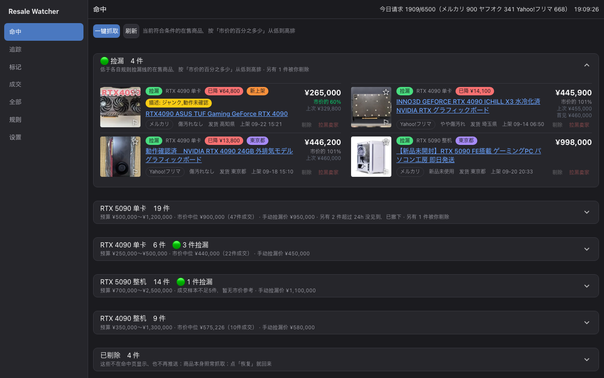
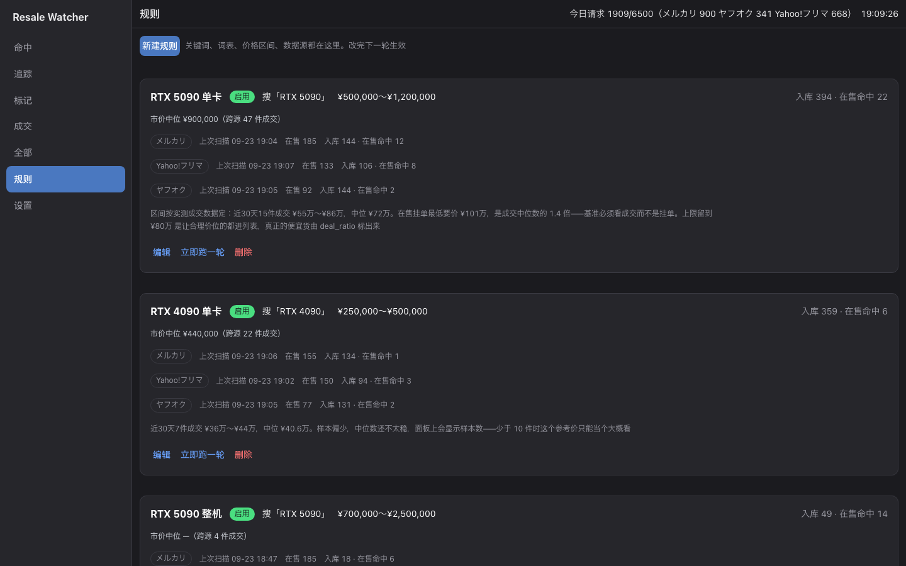
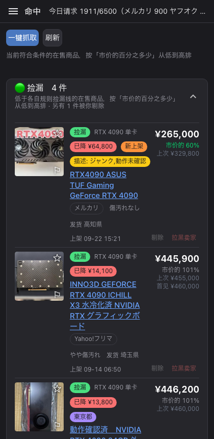
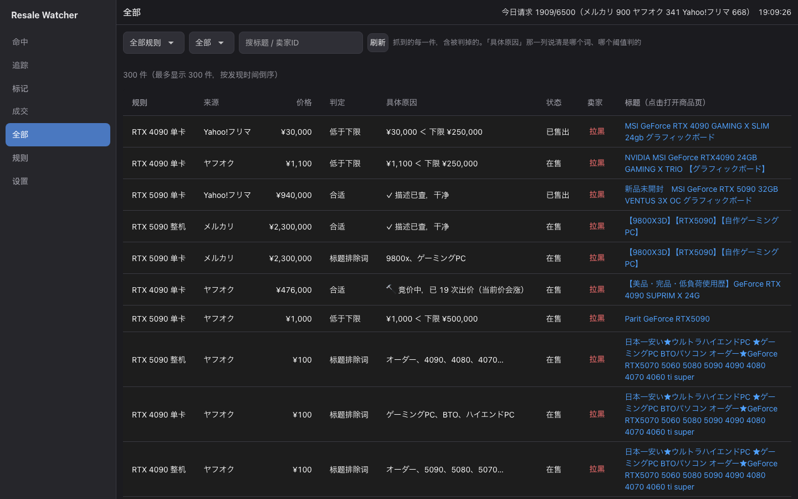
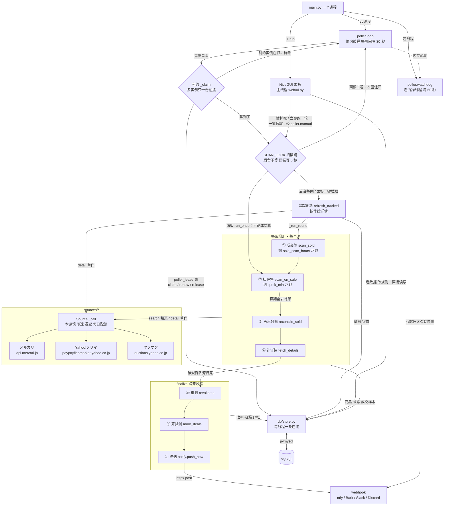

# Resale-Watcher

盯着**日本三个二手平台**（メルカリ / Yahoo!フリマ / ヤフオク）上的关键词——RTX 5090、4090 之类——把**价格合适、又不是坑货**的商品挑出来，按**真实成交价**判断哪件是捡漏，好价第一时间推到手机；之后继续跟着它，看它是降价了还是卖掉了。

不登录、不开浏览器：一个 Python 进程，加一个 MySQL 库。



- **三个平台一起搜。** 三边基本是各自的商品池，只盯一个一定会漏。
- **按成交中位数判捡漏，不看挂单价。** 挂高价的卖不掉、一直挂着，拿挂单当行情会严重高估。
- **好价推到手机。** ntfy / Bark / Slack / Discord / 企业微信 / Telegram，一个 URL 加一个请求体模板就行。
- **误杀看得见。** 标题连必含词 / 任含词都不满足的直接丢弃；过了这一关、再被规则判掉的商品照样入库，「全部」页写明是哪个词、哪个阈值判掉的；描述里的雷只打标签、不否决。
- **对别人的服务器客气。** 全局串行，同一个源请求间隔 3〜8 秒，被限流就退避，每日总量有保险丝。

环境：Python 3.12 · MySQL 8+ · macOS / Linux（`run.sh` 是 bash）。NAS 一键部署需要 Debian / Ubuntu + systemd。

## 目录

- [使用须知](#使用须知)
- [快速开始](#快速开始)
- [面板七页](#面板七页)
- [为什么三个源都要搜](#为什么三个源都要搜)
- [判定三层漏斗](#判定三层漏斗)
- [写规则](#写规则)
- [推送到手机](#推送到手机)
- [各页细节](#各页细节)
- [设置项一览](#设置项一览)
- [请求量与风控](#请求量与风控)
- [部署与运维](#部署与运维)
- [常见问题](#常见问题)
- [开发者参考](#开发者参考)
- [免责声明](#免责声明)

## 使用须知

- **只读公开数据。** 只读取三个平台对匿名访客公开的搜索结果和商品详情页；不登录、不下单、不改动对方任何数据。
- **抓取节奏是刻意保守的，请不要调激进——对面是别人的服务器。** 全局串行、绝不并发；同一个源相邻两次请求之间随机等 3〜8 秒；遇到 429/403/503 指数退避；每日请求总量有上限。
- **面板没有鉴权。** 默认只监听 `127.0.0.1`。改成局域网可访问之后，局域网里谁都能改你的规则、看到你的推送地址。别把它暴露到公网；真要暴露，就让反向代理同时做 HTTPS 和 Basic Auth（纯 HTTP 下 Basic Auth 的密码等于明文），并让面板端口只对反向代理可达。
- **`notify_url` 等于一把钥匙**，谁拿到都能往你手机推东西。别写进截图，也别提交进仓库。
- 本项目与 メルカリ、Yahoo!フリマ、ヤフオク 及其运营方没有任何关联，用之前请自行确认符合各平台的利用规约（见[免责声明](#免责声明)）。

## 快速开始

### 1. 安装

需要 Python 3.12（最低 3.11）和一个 MySQL 8+（一个能建库建表的账号）。

```bash
git clone https://github.com/Gosoki/Resale-Watcher.git && cd Resale-Watcher
python3.12 -m venv .venv && .venv/bin/pip install -r requirements.txt   # 用 3.12；最低 3.11（macOS 自带的 python3 是 3.9，不行）

cp .env.example .env && vi .env      # 填数据库连接
./run.sh initdb                      # 建库建表（seed 之前必须先跑；start 时也会再检查一遍）
./run.sh seed                        # 写入两条起步规则：RTX 5090 单卡 / RTX 4090 单卡
./run.sh start                       # 后台启动 → http://127.0.0.1:2334
```

`start` 之后后台轮询**立刻**开跑第一轮：按规则逐条、每个源依次处理——先抓这个源的成交价（成交轮，算市价中位数用；ヤフオク 不抓成交价），再扫它的在售商品、给过了初筛的新商品读描述，一个源做完再轮到下一个。默认节奏下要几分钟。

> 想先不开面板、手动试一轮，就在 `start` **之前**跑 `./run.sh once`（跑完就退出；它不跑成交轮）。
>
> 服务已经在跑时别再用 `once`：它是另一个进程，不看租约、也拿不到进程内的锁，会和后台同时去打同一个源。
>
> 在面板上想再触发一轮，用「一键抓取」——它和后台轮询共用同一把扫描锁，不会撞车。

### 2. 装完先做这几件事

1. **把起步规则的价格区间改成当前行情。** `seed` 写的是 2026-09-12 的行情（5090 单卡 ¥40 万〜80 万、4090 单卡 ¥25 万〜50 万），行情会变。到面板「规则」页点「编辑」改。
2. **看捡漏线出没出来。** 按百分比判捡漏，得先有成交中位数，而中位数要攒够 5 件成交样本（`median_min_samples`）。热门型号第一轮跑完通常就有了；成交稀少的型号才要等——等不及，就在命中页规则组顶上直接填一个「手动捡漏价」（见[捡漏线用百分比还是手动价](#捡漏线用百分比还是手动价)）。
3. **打开推送。** 设置页填 `notify_url` →「保存全部」→「测试推送」。推送失败平时只写日志，这个按钮是唯一能当场看出通没通的地方。默认只推捡漏（`notify_on=deal`），所以在冷启动期、还算不出捡漏线的时候，可能一条都不会推。
4. **加规则之前先看[请求量](#请求量与风控)。** 默认上限每天 3000 次，大约只够两条规则。

### 3. 日常命令

```bash
./run.sh start | stop | restart | status | logs | fg   # fg：前台跑，日志直接打到屏幕
./run.sh seed               # 写入两条起步规则（同名规则已存在就跳过）
./run.sh once [规则ID]       # 立刻跑一轮就退出，不启面板（服务在跑时别用）
./run.sh replay [规则ID]     # 零请求：拿库里已抓的商品按当前规则重判一遍；加 --apply 才写回
./run.sh test               # 回归测试
./run.sh initdb             # 建库建表
```

`./run.sh status` 不开浏览器也能看到每条规则在每个源上的状态：

```
● 运行中（PID 99418）→ http://127.0.0.1:2334
  今日请求 1908/6500，失败 0
  #1 RTX 5090 单卡  入库394  在售命中22（累计69）  市价中位 ¥900,000（跨源47件）
       メルカリ           平台在售 185  入库144  在售命中12   上次 09-23 19:04
       Yahoo!フリマ      平台在售 133  入库106  在售命中8    上次 09-23 19:07
       ヤフオク           平台在售  92  入库144  在售命中2    上次 09-23 19:05
```

NAS 上由 systemd 管的实例要用 `systemctl restart resale-watcher`，见[部署到 NAS](#部署到-nas)。

## 面板七页

<p>


</p>

- **命中** —— 现在有什么能买。平时只看这一页：最上面是跨规则的捡漏汇总，下面每条规则一组，组内按「市价的百分之多少」从低到高排。点图角上的 ☆ 追踪、⚐ 标记；每行可以「剔除」「拉黑卖家」；规则组顶上直接改捡漏价；「一键抓取」。（[详细](#命中)）
- **追踪** —— 盯住的几件现在怎样。在售的每 `track_min` 分钟、交易中的每 `trading_recheck_min` 分钟单独拉一次详情，价格、出价数、卖没卖都比整轮扫描新；「一键拉取」。（[详细](#追踪)）
- **标记** —— 我标下来的东西。纯书签：不发请求、不参与判定；存下标记那一刻的快照，并排显示它现在怎样了；可以写备注。（[详细](#标记)）
- **成交** —— 市场实际用什么价清掉了什么货。看成交价的分布，而不只是中位数那一个数字；「曾是捡漏」＝你错过的。（[详细](#成交)）
- **全部** —— 抓到的每一件，含被判掉的。按规则、按判定筛，搜标题或卖家 ID；「具体原因」一列说清是哪个词、哪个阈值判掉的。（[详细](#全部页每一件是被哪个词判掉的)）
- **规则** —— 规则本身。新建、编辑、立即跑一轮、删除；每条规则在每个源上的轮询状态；最下面是拉黑列表。（[详细](#写规则)）
- **设置** —— 对所有规则生效的全局项。24 项分 5 组，改完 10 秒内生效；「测试推送」。（[详细](#设置项一览)）

窗口窄于 1024px 时，左侧导航自动收成抽屉，顶栏左边出现 ☰，手机上也能用。

## 为什么三个源都要搜

**三边基本是各自的商品池，必须都搜。** 2026-09-12 项目刚跑起来时的一次实测，同一关键词「RTX 5090」：

| 源 | 在售 | 命中 |
|---|---|---|
| メルカリ | 188 | 1 |
| Yahoo!フリマ | 108 | 7 |
| ヤフオク | 47 | 2 |

那一次 Mercari 只贡献了 1 件——只盯 Mercari 会漏掉九成。这个比例会随时间变（2026-09-23 同一条规则，三边的在售命中是 12 / 8 / 2），但「只盯一个源一定会漏掉一大块」这一点不变。

三边也不是完全不重叠：少数卖家会把同一件同时挂在两个平台上；另外 Yahoo!フリマ 的搜索接口会把 ヤフオク 的一口价商品也一起返回（商品 ID 是 ヤフオク 的），而代码目前只在 ヤフオク 一侧滤掉了混进来的 フリマ 商品，反方向没有滤。所以同一件 ヤフオク 商品可能在两个源下各入库一次，命中页上会出现两次。

每条规则可以指定搜哪些源（规则的 `sources`，留空＝全部）。各源的请求间隔、退避档位、到点时间各自独立，一个源被限流不会让别的源也进退避。但轮询只有一条线程：一个源退避睡觉的时候，其余源会被顺延（见[请求量与风控](#请求量与风控)）。

### ヤフオク 以拍卖为主，和另外两个不一样

它有一口价、起拍价、结束时间、出价数（メルカリ 也有少量拍卖商品，同样有出价数和截止时间，只是没有一口价，面板和推送的显示方式一样）。判「价格合适」用的是**当前价**，但当前价只在此刻成立——所以面板上会同时摆出出价数和剩余时间：

```
¥858,000  市价的 110%
🔨 竞价中 · 已 10 次出价 · 当前价还会涨 · 剩 1 天 3 小时
```

不把这行摆出来，「命中」两个字就是在误导人。

**ヤフオク 的成交价不去单独抓**（落札相場页没法稳定解析，见[数据源实现](#数据源实现)）。但被规则命中的拍卖，只要一路跟到结束、确实有人出过价，成交价照样会记成样本、进中位数——中位数本来就是这条规则所用各源的样本合在一起算的。

## 判定三层漏斗

**能在前一层用零成本干掉的，绝不留到下一层。** 每个数据源各自跑一遍这个漏斗：

```
某个源搜索「RTX 5090」，返回 N 件在售
  │
  ├─ 第 1 层  必含词 include_all / 任含词 include_any 不满足  → 直接丢弃，不入库
  │           （Mercari 的搜索是模糊的，会返回标题里压根没有 5090 的东西。
  │             早期一次实测这一层丢掉 86 件：电源线、DP 线、显卡支架、TITAN V…）
  │
  ├─ 第 2 层  拉黑卖家 / Shops 商家 / 标题排除词 / 品相 / 价格区间
  │           → 入库，但标 matched=0，并记下 reject_reason
  │           （留痕是刻意的：价格超区间的明天可能降价；
  │             而且你按 reject_reason 一分组，就能看出自己有没有误杀好货）
  │
  └─ 第 3 层  对通过前两层的候选，拉一次商品详情读描述
              → 描述警示词命中就打个黄标，【但商品照样留在命中列表里】
              （「ジャンク」「異音」这类雷经常只写在描述里，
                但拿描述词做否决，误杀风险太大，见下面的坑 2）
```

**第 3 层为什么只标记、不否决**——这是整个设计里最重要的一条取舍：

> **误杀是沉默的**：被毙掉的商品不会出现在任何列表里，你永远不会知道错过了什么。
>
> **漏筛是可见的**：带黄标进来的坏货，你扫一眼就跳过了。
>
> 命中列表平时每条规则也就几件到二十几件，多几件根本不是负担，而少一件你就再也看不见了。

第 3 层请求很少：只给还没读过描述的命中各拉一次详情，每个源每轮另有 `detail_budget`（默认 10）封顶。

扫完所有源之后，再做两件**跨源**的事（纯 CPU，零请求）：

- **重判**：用当前规则把这条规则名下所有源的商品重判一遍。所以你在面板上删掉一个排除词、点保存，被它误杀的商品**当场**就回到命中列表（保存时立即重判；直接改数据库的话，要等下一轮扫描收尾）。
- **算捡漏**：用**跨源合并**的成交中位数，给命中商品标上「市价的百分之多少」。市价是「这东西值多少钱」，和它挂在哪个网站无关；合并之后样本更多，也更稳。

## 写规则

规则在面板「规则」页，也可以直接看数据库 `watch_rule` 表——每个业务列都带中文注释，用 Navicat / DBeaver 打开也能看懂。保存后，库里已有的商品会当场按新规则重判；抓取从下一轮开始按新规则来。

### 规则字段速查

词表用逗号（半角、全角都行）、顿号、分号或换行分隔。

| 字段 | 含义 | 默认 | 例子 |
|---|---|---|---|
| `name` | 规则名，只给人看（必填） | — | `RTX 5090 单卡` |
| `enabled` | 启用。停用后这条规则不再参与扫描（搜索、对账、补描述都停），但它名下已追踪的商品仍会单独刷新——要停就先取消追踪 | 1 | |
| `keyword` | 发给各个源的搜索词。宁可宽一点，精筛交给下面的词表（必填） | — | `RTX 5090` |
| `sources` | 搜哪些源：`mercari` / `yahoo_flea` / `yahoo_auction`，逗号分隔；留空＝全部 | 空 | `mercari,yahoo_flea` |
| `include_all` | 必含词，标题里要**全部**出现；不满足的直接不入库 | 空 | `5090` |
| `include_any` | 任含词，出现**任意一个**即可；不满足的直接不入库 | 空 | `ryzen,ultra9,ゲーミングpc`（整机规则） |
| `exclude_any` | 标题排除词，命中任意一个就判不合适（照样入库，「全部」页看得到原因） | 空 | `ジャンク,部品取り,箱のみ,ノート` |
| `warn_desc` | 描述警示词，只在描述里查。**命中只打黄标，不毙掉商品**；要配合 `check_desc=1` | 空 | `ジャンク,動作未確認,マイニング` |
| `price_min` / `price_max` | 价格区间（日元，含两端）；0＝不限 | 0 / 0 | `400000` / `800000` |
| `condition_ids` | 品相白名单：1 新品未使用 … 6 全体的に状態が悪い，逗号分隔；留空不限。ヤフオク 不给品相，不做这项检查 | 空 | `1,2,3` |
| `allow_shops` | 也收商家出品：メルカリShops，以及 ヤフオク 的ストア出品（关着时两者都判成「Shops商家品」）。Yahoo!フリマ 的接口不给商家标记，对它不生效 | 0 | |
| `check_desc` | 初筛通过后拉一次详情读描述（占 `detail_budget`） | 1 | |
| `deal_price` | 手动捡漏价：低于它就算捡漏。**填了就完全取代 `deal_ratio`**，而且不依赖成交样本；0＝不用 | 0 | `600000` |
| `deal_ratio` | 捡漏线：低于「成交中位数 × 此值%」标捡漏；0＝不判 | 85 | |
| `quick_min` | 多久把这个关键词全扫一遍（分钟，实际抖动 ±20%），至少 1 | 7 | `7`（单卡）/ `30`（整机） |
| `note` | 备注 | 空 | |

> `watch_rule` 里还有一列 `exclude_sellers`，已在 2026-09-17 废弃（卖家拉黑改成了全局列表，见[拉黑列表](#拉黑列表)）。代码不再读写它；表结构同步只加不删，所以它还留在库里。

### 词表会自动归一化，不用穷举变体

匹配前会做：**NFKC → 小写 → 删掉所有空格和符号**。所以：

| 你填 | 能命中 |
|---|---|
| `5090` | `RTX 5090` / `RTX5090` / `ＲＴＸ５０９０` / `rtx-5090` / `GeForce　RTX　5090` |
| `ジャンク` | `ジャンク` / `ｼﾞｬﾝｸ` |

### 捡漏线用百分比还是手动价

捡漏默认按「成交中位数 × `deal_ratio`%」判。基准必须是**成交**而不是挂单（原因见下面的[坑 3](#三个实测踩过的坑)），但这套有个硬前提：**先得有中位数**，而中位数要先攒够成交样本。两种情况下它整个不工作：

- 规则刚建，成交样本还没攒够；
- 某个型号本来就成交稀少，永远攒不够。

还有更常见的一种——**挂单价系统性高于成交价**。2026-09-13 实测 RTX 5090：成交中位 ¥785,000，按当时设的 90% 算出的百分比线是 ¥706,500，而在售最低要 ¥869,000（一场 ヤフオク 拍卖的当前价）。百分比线**永远不可能被碰到**，捡漏徽标一次都不会亮。

所以规则里有一个 `deal_price`：**低于它就算捡漏，填了就完全盖过百分比。** 它不依赖任何成交样本，你心里的价就是价。

改的地方有两处：规则页的编辑框，以及**命中页每条规则顶上直接改**——一边看着在售列表一边调，改完立刻重算，不用等下一轮。（那一栏放在「当前没有符合条件的在售商品」之上，因为一件都没命中的时候，正是你最想调它的时候。）

> 摘要行会如实显示当前生效的是哪一个：填了手动价就显示「手动捡漏价 ¥X」，不再显示百分比线，免得你对着一个不生效的数字纳闷。

### 整机规则：挡掉定制接单和笔记本

`./run.sh seed` 只写两条**单卡**规则；整机规则要自己在「规则」页新建：`keyword` / `include_all` 和单卡一样（`RTX 5090` / `5090`），`include_any` 填 CPU 型号加 PC 长词，`exclude_any` 按下面的思路填。下面给的是作者整机规则里的代表词，不是完整词表；其中「别的显卡型号」要换成你自己盯的型号以外的那些。

盯整机（不是裸卡）时，光靠「5090 + PC」会捞进三类假货，各有各的判据：

| 混进来的 | 例子 | 怎么挡 |
|---|---|---|
| **定制接单** | 『カスタムゲーミングPC』ご相談受付中！RTX5060Ti/5070/5080/5090搭載など | `ご相談`/`受付中`/`オーダー`/`カスタム`/`変更可能` |
| **拿本型号当性能对比** | RTX**5070Ti** 16GB(**4090**/4080/5080に近い性能) | 排除**别的显卡型号** |
| **笔记本** | GALLERIA UL9C-R49 ゲーミングPC **13900HX** 4090 | `ノート`/`インチ`/`18型` + **移动 CPU 后缀** |

后两条是这套词表里最有用的两个技巧：

- **把「别的显卡型号」当排除词。** 一台真 5090 整机的标题不会同时出现 4080/5070；会并列一串型号的，要么是接单配置器，要么是把你要的型号只写在括号里做性能对比。
- **移动 CPU 后缀 `H` / `HX`。** 桌面 CPU 以 `K`/`KF`/`X`/`X3D` 结尾，笔记本是 `H`/`HX`。上表那条标题写着「ゲーミングPC」、没有「ノート」两个字，只有 `13900HX` 暴露了它是笔记本。

`include_any` 填的是 **CPU 型号 + PC 词**：整机几乎都会写出其中之一，而裸卡和配件大多不会——所以绝大部分「显卡单品」自己就过不了第 1 层。但这不是绝对的：有卖家会在裸卡标题里挂「ゲーミングPC」，「デスクトップPC用グラボ」这种写法也会被 `デスクトップ` 放进来。整机规则里混进了裸卡，可以考虑把 `グラフィックボード` / `グラボ` 加进 `exclude_any`——加之前先用 [`replay`](#改完词表先重放) 看会不会误杀标题里提到这些词的整机。

> ⚠ 别把 `PC` 单独当匹配词：归一化会把 `PCI-E 5.0` 变成 `pcie50`，里面就含 `pc`，一整批转接线和延长线会全部命中。要用 `ゲーミングpc` / `デスクトップ` / `パソコン` 这种长词。

### 三个实测踩过的坑

这三个坑都是真金白银试出来的，改词表前先看一眼。

**坑 1：整机和笔记本，靠品牌名是列举不完的**

`Razer Blade 18 / RTX 4090/32GB/2TB` 曾经混进命中列表——Razer、ThinkPad、DAIV、Alienware、GALLERIA、Legion、Predator… 永远列不完。

**更可靠的是侧面信号**，现在的排除词表就是围绕这个建的：

- **CPU 型号**（`ryzen` `ultra9` `14900` `9950x` `275hx`…）：整机和笔记本必写 CPU，单卡标题绝不会出现；
- **存储容量**（`1TB` `2TB` `512GB` `SSD`）：显卡标的是显存（24GB/32GB），永远不会出现 TB 和 SSD；
- **屏幕尺寸**（`インチ`）：单卡不标英寸。

**坑 2：描述里的词多半是「否认」，拿它做否决会误杀好卡**

两块 ¥48 万 / ¥50 万的好卡曾被 `マイニング` 毙掉过，因为描述里写着：

> 「マイニング**等の負荷が高い用途では使用しておらず**」＝「**没有**用于挖矿等高负荷用途」

**真挖过矿的卖家不会自招**（那等于砸自己的价），只有想自证清白的才会主动提这个词。所以「マイニング」做否决词根本拦不到真矿卡，只会误杀良心卖家。实测印证：截至 2026-09-23，库里描述命中「マイニング」的 15 条挂单逐条看过，**全部是否认**（「マイニング歴なし」「マイニング用途での使用はありません」…）。

这就是第 3 层只打标签、不否决的原因。

> **曾经为此做过一套日语否定词表 + 逐句切分，后来砍掉了。**
>
> 理由：标签本来就只是「你来看一眼」，误挂一个的代价是你多扫一眼；而那套逻辑要额外维护一份否定词表，还要处理句子边界——不值当。现在「マイニング使用しておらず」照样会挂标签。
>
> **嫌某个词的标签太吵，直接去规则页把它从 `warn_desc` 里删掉。** 比如「マイニング」在描述里几乎总是以否认形式出现，留着它，标签会很密。

**坑 3：不能拿在售挂单当行情基准**

| RTX 5090 单卡（2026-09-12，只统计 メルカリ） | |
|---|---|
| 近 30 天**成交**中位数（15 件） | **¥720,000** |
| 在售**挂单**最低要价（个人出品） | ¥1,010,000 |

挂高价的卖不掉、一直挂着，所以在售列表严重高估行情。`deal_ratio`（捡漏线）算的是**成交**中位数，不是挂单价。

### 「全部」页：每一件是被哪个词判掉的



判定旁边有一列**具体原因**，和判定逻辑读的是同一份词表和阈值，所以永远一致：

| 判定 | 具体原因 | 商品 |
|---|---|---|
| 标题排除词 | `14900、SCAR` | ROG Strix SCAR G834 i9 14900HX |
| 标题排除词 | `2TB、ノート` | DELL i7 13代 2TB RTX4090 32gb ノートPC |
| 超预算 | `¥3,500,000 ＞ 上限 ¥1,200,000` | RTX 5090 LIGHTNING Z 搭載 究極デスクトップ |
| Shops商家品 | `メルカリShops 商家出品（规则没开「收 Shops」）` | 新品 CY ATX3.0 PCI-E 5.0 |
| 合适 | `⚠ 描述含：マイニング` | MSI SUPRIM Liquid X RTX 4090 |

调词表时按这一列看，就知道每个词到底在替你挡什么、有没有挡错。**标题本身就是链接**，点一下在新标签页里打开商品页。

> **这一列上线当天就抓出一个真误杀**：词表里原本有 `5090D` / `4090D`（中国特供 D 版），而归一化会把「RTX 5090 **DUAL**」变成 `rtx5090dual`，里面正好含 `5090d`——ASUS DUAL 这个主流型号会被当成 D 版杀掉。D 版在日本 Mercari 实测 0 件，为防一个不存在的东西误杀主流型号不划算，所以这两个词已经删了。
>
> **加新排除词时留意这类子串陷阱**：先把词往真实型号名里套一遍再决定。已知安全的反例见 `tests/test_matcher.py::test_排除词不能误杀ASUS_DUAL`。

### 改完词表先重放

```bash
./run.sh replay 1          # 零请求：拿库里已抓的商品，按当前规则重跑一遍
./run.sh replay 1 --apply  # 确认没问题，再写回数据库
```

重点看输出最后那段 **「⚠ 潜在误杀」**——被标题排除词拦下、但价格正好落在你预算区间里的商品，并列出每件命中了哪个词。真正的误杀只会出现在这里（价格不合适的，本来你也不会买）。重放只能覆盖**已经入库**的商品：第 1 层丢掉的从没入过库。

> **误杀是沉默的。** 加宽排除词，最多多几条噪音，你一眼能看见；加狠了，就再也看不见了。宁松勿紧。

## 推送到手机

**面板是用来复盘的，抓现货得靠推送。** 2026-09-12 的数据：RTX 5090 成交中位数约 ¥78 万（メルカリ + Yahoo!フリマ 近 30 天的成交），而这两个平台上在售的真卡最便宜也要 ¥93 万；把 ヤフオク 算上，¥93 万以下也只多出一场正在竞价的拍卖（当时 ¥85.8 万，次日 ¥87.6 万落槌）。好价的卡一挂出来就被买走了，它从来没在面板上停留到你下次打开的那一刻。

在「设置」页填上 `notify_url` 就会开始推送，**留空＝完全关闭，一个请求都不发**。填完先点「保存全部」，再点「测试推送」（它读的是已保存的设置）：正式推送失败只写日志、面板上不会有任何提示，这个按钮会把出错原因当场弹出来。显示「已发出」之后，还要去手机上看一眼——没收到，就是地址或请求体模板不对。

不接任何一家的 SDK，就是一个 URL 加一个请求体模板：

| 服务 | `notify_url` | `notify_body` |
|---|---|---|
| Slack | `https://hooks.slack.com/services/T…/B…/…` | `{"text": "{text}"}`（带商品图的模板见设置页 `notify_body` 的说明） |
| ntfy | `https://ntfy.sh/你的主题` | 留空 |
| Bark | `https://api.day.app/你的KEY` | `{"body": "{text}"}`（**不能留空**：留空会按纯文本发，Bark 不解析纯文本正文，手机上只收到「Empty Message」） |
| Discord | webhook 地址 | `{"content": "{text}"}` |
| 企业微信 | 群机器人 webhook | `{"msgtype":"text","text":{"content":"{text}"}}` |
| Telegram | `https://api.telegram.org/bot<TOKEN>/sendMessage` | `{"chat_id":"你的id","text":"{text}"}` |

`{text}` 是提醒正文，`{thumb}` 是商品缩略图地址，填进 JSON 时都会自动转义——日文商品名里的引号不会把模板撑破。模板里写了 `{thumb}`、而这件商品恰好没图时，整个模板会换成固定的 `{"text": "{text}"}`（否则 Slack 会对空的图片地址回 400，整条丢掉）；这个兜底是按 Slack 的格式写的，用别家时别在模板里放 `{thumb}`。同一轮要推多条时，条与条之间隔 1.2 秒（Slack 每个 webhook 每秒限 1 条）。

推出去长这样（价格在第一行——手机通知栏只看得见前两行，决定要不要点开的那个数必须在里面）：

```
🟢 捡漏 ¥350,000 · 市价的 81% | RTX 4090 单卡
MSI GeForce RTX 4090 VENTUS 3X E 24G OC 3ファン搭載 グラフィックスボード
中位 ¥427,800
🔨 拍卖 · 已 1 次出价 · 还会涨 · 剩 3 小时（09-15 20:58 截止）
https://page.auctions.yahoo.co.jp/jp/auction/xxxxxxxxx
```

按手动捡漏价判出来的，写「低于手动线 ¥950,000」而不是「市价的 114%」——那两个并排看着自相矛盾。

同一件商品可能收到三种提醒：

| 头 | 什么时候 | 设置 |
|---|---|---|
| 🟢 捡漏 / 命中 | 它刚够格的那一刻，每件一次 | `notify_on` |
| 📉 再降 | 推过之后，比**上次推送时的价格**又跌够 N% | `notify_redrop_pct`，默认 0＝关 |
| ⏰ 捡漏快结束 | 拍卖进入最后 N 分钟、价格还在捡漏线内 | `notify_final_min`，默认 60 |

在命中页**剔除**的商品、**拉黑**卖家的商品，一律不再推送（含快结束提醒）。

两个默认值是刻意的：

- **只推捡漏**（`notify_on=deal`）。命中只是「符合你的条件」，捡漏才是「该立刻去看」。所有命中都推的话，一条规则几十件在售，会让你一天之内就把推送关掉。要全推就改成 `matched`。
- **每条规则每轮最多 5 条**（`notify_max_per_round`；新命中和「📉 再降」合在一批算），**超了就这一批一条都不推、全部标成已推。** 挡的是三种一次性井喷：刚填上 URL（库里几十件老命中一起轰出来）、停机几天后重启（攒下的过期货）、放宽规则或改价格区间（几百件同时变成命中）。代价是真有一波好货时会被整批跳过，但那种情况面板上看得到；而被几十条通知淹掉的人，只会直接把推送关掉。快结束提醒单独按同一个上限计，不会被新命中的井喷一起吞掉。

**发送失败分两种：**

- **瞬时失败**（HTTP 429、5xx、网络错误或 5 秒超时）：这一轮不标已推，下一轮按同样的条件重新挑一遍，仍够格才重推——都要还在售、还命中；🟢 / 📉 在 `notify_on=deal` 时还要仍算捡漏，📉 还要仍比上次推送价低够 `notify_redrop_pct`%；⏰ 不论 `notify_on` 都要仍算捡漏、且仍在最后 `notify_final_min` 分钟内。重试的这些也计入上面那个每轮上限。
- **其它失败**（429 以外的 4xx，比如 404 / 401 / 400，多半是地址或模板写错了）：再试也一样，直接记成已推，不再重试。

两种都会在日志里记一行 warning。

## 各页细节

「全部」页见[「全部」页：每一件是被哪个词判掉的](#全部页每一件是被哪个词判掉的)，「规则」页见[写规则](#写规则)，「设置」页见[设置项一览](#设置项一览)。

### 命中

- 最上面的「🟢 捡漏」是**跨规则**汇总，也是这一页唯一默认展开的块：平时一天 0〜4 件，真正要抢的东西不会埋在几十屏命中里。下面每条规则一组，默认折叠。
- **徽标分两类。信号**（实心）回答「要不要点进去」：捡漏、已降 ¥X、新上架（平台给的上架时间在 `fresh_hours` 内）、新发现（我们第一次抓到它在 `fresh_hours` 内；ヤフオク 不给上架时间，只会有这个）、東京都（发货地）、描述: 警示词。**标签**（描边）只回答「它是什么」：来源、数据源。
- 超过 `stale_warn_hours`（默认 2 小时）没在搜索结果里见到的，挂灰色「失联 Nh」——这时显示的价格是几小时前的，多半是那个源在限流；超过 `stale_hide_hours`（默认 24 小时）就从命中页撤下（「全部」页照样看得到，重新出现就自动回来）。
- **剔除**：这件不再在命中页显示、不再推送，但照常抓取。页面最下面的「已剔除」里点「恢复」就回来。
- 窗口 ≥1280px 时排成两列。

### 追踪

平时商品的价格和状态只在**整轮关键词扫描**时更新——每条规则的 `quick_min`（默认 7 分钟），一轮还要把所有源走一遍。盯一件快要结束的拍卖时，这个延迟不够用。

在命中页点商品图**右上角那颗星**（☆ → ★），它就会被**单独拉详情页刷新**（メルカリShops 的商品除外：拉不到它们的详情，追踪了也只随整轮扫描更新）：

- 价格、是否卖掉、发货地；
- **出价数**——整轮扫描也会更新它，但只有这条路能**及时**拿到，而那恰恰是你盯一件拍卖的理由。

追踪中的商品在「**追踪**」页，还在售的每行标着上次刷新时间（已卖掉的改标成交时间），因为这一页的卖点就是数据新。星在那边是实心琥珀色，再点一下就取消——**实心/空心本身就能看出状态**，不必靠颜色分辨。

**卖掉或下架的不会被摘掉追踪**：结果留在追踪页，沉到列表底部，带着「已卖掉」「已下架」徽标，之后不再发请求刷新。你盯了几天的东西，最该看的就是它最后卖了多少——一成交就从列表里消失，等于把结果藏起来了。卖掉的同时照常出现在「成交」页。日志里也会点名：`追踪中的「X」卖掉了 ¥Y —— 结果留在追踪页，不再刷新`。不想看了，再点一下星就取消。

> 留着不花代价：刷新只挑还在售、交易中的，已结束的一个请求都不发；追踪页顶上那个「满负荷约 N 次请求/天」的估算也只按这些件数算。
>
> 「不摘」由测试守着：把状态改成终态（卖掉 / 下架）的路径有两条（`store.set_status` 和 `store.update_tracked`），哪条偷偷清掉了追踪标记，表现都是「追着追着东西不见了」。

> **这是全项目唯一由你亲手点选、按件定时反复发请求的功能**（售出对账和补描述也按件拉详情，但只针对失踪的或刚过初筛的商品，而且有 `detail_budget` 封顶）。追 10 件、间隔 5 分钟 ＝ 满负荷每天 2880 次：差不多是 `seed` 那两条规则一天的全部请求（估算约 3000 次，见[请求量与风控](#请求量与风控)），一项就吃掉默认上限 3000 的 96%。而 `daily_request_limit` 一满，是**所有规则所有源一起停**。
>
> 所以有两道闸：`track_min`（默认 5 分钟）控在售件的刷新间隔（交易中的按 `trading_recheck_min`，默认 180 分钟），`track_budget`（默认 10）控每轮件数——超了就按「最久没刷新的优先」轮着来，不会饿死谁，只是每件的实际间隔变长。追踪页顶上实时显示满负荷请求量，加之前先看一眼那个数。

判断「到没到点」用的是 `last_seen_at`（最后一次拿到新数据的时间），不另开一列——这样**刚被整轮扫过的商品不会立刻又被单独拉一次**：搜索结果里已经有价格和状态了，再发一个请求纯属浪费。

### 标记

在「命中」「追踪」「成交」页点商品图**右下角那面小旗** ⚐，就标上了。**一个请求都不发，随便标。**

标记页同时摆两份数据，缺一个都不成立：

- **快照**：按下标记那一刻的标题、价格、图，存在 `marked_item` 表里，之后不再变；
- **现况**：那件商品现在怎么样了（现查）。

只有快照，这一页就是一堆旧照片，看不出后来降没降、卖没卖；只有现况，商品一下架整条记录就变成空白——而那正是你最想回头查的时候。

每条标记可以写一句备注。**有备注的标记不能在图角上一下点掉**：先到标记页把备注清空，再取消——防的是误点一下，几个月前写的「为什么标它」就没了。

### 成交

命中页回答「现在有什么能买」，靠的是拿在售价和成交中位数比。但中位数是**一个数字**，看不出它底下的分布——是十几件挤在同一个价位，还是从 ¥40 万到 ¥90 万拉了一条长线。定价前要看的是后者，所以「**成交**」单开一页。

两类数据粒度不同，都摆出来：

| | 来源 | 有什么 |
|---|---|---|
| **跟到成交** | `item` 表里 `status='sold_out'` 且 `matched=1` | 标题、缩略图、首次挂价、**降了多少才卖掉**、发货地 |
| **成交价样本** | `sold_sample` 表 | 只有价格和时间；页面上不单列，只用来算中位数和价格区间 |

「跟到成交」是我们一路跟着的商品后来确认卖掉了，有三条路：售出对账（从在售搜索里消失后拉详情确认）、成交轮（成交搜索里直接看到库里还标着在售的，就地改成已售出，一个请求都不多发）、追踪刷新读到已售。其中「从 ¥X 降了 ¥Y 才卖掉」是定价最直接的参考：挂多少没人要、降到多少成交。

带「曾是捡漏」标的是**你错过的**——它在售时低于捡漏线，而且确实有人接了。

### 拉黑列表

某个店铺反复挂高价货刷屏时，在命中页那一行点「**拉黑卖家**」，**所有规则、所有源**下他的商品**立刻**判为不合适（`reject_reason=seller`），也不再推送，不用等下一轮。

- **是一份全局列表**（`blocked_seller` 表），不属于任何一条规则。同一个刷屏的店铺往往同时撞上好几条规则，按规则各拉一次，等于同一个意图要表达 N 遍；漏掉一条，他的商品照样从那条规则推到你手机上。
- **两个页面都能拉黑。** 命中页在每行价格列的底下；「全部」页有一列「卖家」，按钮三态：`拉黑` 可点 / `已拉黑` 已在列表里 / `—` 这件商品没有卖家 ID。
- **列表在「规则」页最下面**：谁被拉黑了、什么时候拉的、当时点的是哪件商品（可以点开），以及「解除」。同一块里还能**手动粘 ID**，一次可以粘多个——你在源站页面上先看到这个人时用得着。
- **拉黑不删数据**，只是判成不合适。点「解除」会当场全局重判一次，合适的商品立刻回到命中页。
- **メルカリShops 按店铺拉黑。** Shops 商品的卖家是店铺不是个人，拉黑一次就屏蔽这家店的全部商品。
- **卖家 ID 未知的商品一律放行。** ヤフオク 有一部分商品确实不给卖家 ID——不知道 ≠ 命中，和品相白名单同一个道理。

## 设置项一览

### `.env`（改了要重启）

`.env` 里只放改了**必须重启**才生效的东西：数据库连接和面板监听。其余配置全在面板上，改完即时生效。

| 变量 | 默认 | 说明 |
|---|---|---|
| `DB_HOST` | `127.0.0.1` | MySQL 地址 |
| `DB_PORT` | `3306` | |
| `DB_USER` | `root` | 需要能建库建表 |
| `DB_PASSWORD` | 空 | `.env` 在 `.gitignore` 里，不会进仓库 |
| `DB_NAME` | `resale_watcher` | 库名；启动时自动建库建表，不用去改 `schema.sql` |
| `DB_CONNECT_TIMEOUT` / `DB_READ_TIMEOUT` / `DB_WRITE_TIMEOUT` | `10` / `30` / `30` | 连接和读写超时（秒）。`.env.example` 里没列，要改就自己加。pymysql 默认读超时是无限等——2026-09-15 一条半开的连接让轮询线程卡了 40 小时 |
| `WEB_PORT` | `2334` | 面板端口 |
| `WEB_HOST` | `127.0.0.1` | 面板监听地址。只有本机能访问；要让局域网里的其他机器访问就填 `0.0.0.0`（面板没有鉴权） |

### 面板「设置」页（改完 10 秒内生效，不用重启）

数据库 `app_setting` 表，共 24 项，按 5 组显示，每一项在面板上都带中文说明。标 **不能填 0** 的，在面板上填 0 或负数会被拦下、不保存——这几项的 0 不是「关闭」，而是会让轮询退化或把成交样本删空。

**推送**

| 键 | 默认 | 说明 |
|---|---|---|
| `notify_url` | 空 | 推送地址；留空＝不推送，一个请求都不发。地址写错是静默失败，填完一定点「测试推送」 |
| `notify_body` | 空 | 请求体模板（JSON）。留空＝把正文当纯文本发（ntfy 这么用；Bark 必须填模板）；`{text}` 占正文、`{thumb}` 占缩略图地址 |
| `notify_on` | `deal` | `deal` 只推捡漏；`matched` 推所有命中 |
| `notify_redrop_pct` | `0` | 推过的再跌多少 % 就再推一条「再降」；0＝每件只推一次。只对定价商品有用 |
| `notify_final_min` | `60` | 拍卖只剩这么多分钟、价格还在捡漏线内时，再推一条；0＝关 |
| `notify_max_per_round` | `5` | 每条规则一轮最多推几条新命中和「📉 再降」（两种合在一批算；快结束提醒另算一份同样的上限）；哪一批超了，那一批就一条都不推、全部标成已推 |

**面板显示**

| 键 | 默认 | 说明 |
|---|---|---|
| `fresh_hours` | `24` | 「新上架 / 新发现」徽标的时间窗（小时）。**不能填 0** |
| `stale_warn_hours` | `2` | 多久没在搜索结果里见到就标「失联」（小时） |
| `stale_hide_hours` | `24` | 多久没见到就从命中页撤下（小时）；只是撤下，不删除 |

**追踪**

| 键 | 默认 | 说明 |
|---|---|---|
| `track_min` | `5` | 追踪中的商品单独刷新的间隔（分钟）。**每件每次都是一个真实请求** |
| `track_budget` | `10` | 每轮最多刷新几件；超了按「最久没刷新的优先」轮着来 |

**市价基准**

| 键 | 默认 | 说明 |
|---|---|---|
| `median_window_days` | `30` | 只用最近这么多天的成交算中位数，窗口外的样本**会被删除**。**不能填 0** |
| `median_min_samples` | `5` | 样本不够就不出中位数，也不做百分比捡漏判定 |

**抓取节奏**（直接决定会不会被风控）

| 键 | 默认 | 说明 |
|---|---|---|
| `req_delay_min` / `req_delay_max` | `3.0` / `8.0` | 同一个源两次请求之间的随机等待（秒）。**不能填 0** |
| `daily_request_limit` | `3000` | 当天全源合计超过它，**所有规则、所有源**停抓到次日 0 点（JST）。**不能填 0** |
| `max_pages` | `5` | 每条规则在每个源上每轮最多翻几页（一页约 100〜120 件）。**不能填 0** |
| `search_reuse_min` | `5` | 同关键词的两条规则，这么多分钟内只翻一次页；0＝关 |
| `detail_budget` | `10` | 详情请求预算：每个源、每个阶段（售出对账 / 补描述）各一份。**不能填 0** |
| `missing_grace_min` | `20` | 商品从搜索结果里消失这么久，才去拉详情核实是不是卖掉了。**不能填 0** |
| `trading_recheck_min` | `180` | 「交易中」的商品多久核实一次是否已成交 |
| `sold_scan_hours` | `24` | 多久抓一次成交价、重算市价中位数。**不能填 0** |
| `poller_lease_sec` | `600` | 多实例轮询租约（秒）；0＝不用租约，各抓各的 |
| `poller_stall_min` | `10` | 轮询心跳停多久就推一条告警（分钟）；0＝关 |

> 「不能填 0」的检查只在面板保存时做；用 Navicat 之类直接改库会绕过去。

**拉黑列表也是全局的，但不在这一页**：它会一直变长，不适合塞进 `app_setting` 那种一行一项的表，所以单独一张 `blocked_seller`，入口在「规则」页最下面（见[拉黑列表](#拉黑列表)）。

## 请求量与风控

以「RTX 5090」为例，三个源在售加起来几百件，每源 1〜2 页就翻完（一条规则一轮约 5 页），所以每轮都是全量扫描——新上架、降价、售出一次全抓到，不需要分快轮慢轮。

| 项 | 值 | 说明 |
|---|---|---|
| 扫描间隔 | 每条规则 `quick_min`（默认 7 分钟），实际抖动 ±20% | 各条规则独立计时 |
| 请求间隔 | 同一个源两次请求之间随机 3〜8 秒（`req_delay_min/max`） | 全局串行、绝不并发；按源各自计时，切到另一个源时不额外等 |
| 单轮请求 | 每条规则约 5 次搜索（メルカリ 2 页 + フリマ 2 页 + ヤフオク 1 页）+ 详情：售出对账、补描述每源各最多 `detail_budget`（默认 10）次 | 稳态下详情只有个位数 |
| 成交轮 | 每 `sold_scan_hours`（默认 24）小时一次，≤ `max_pages` 页 | 算市价中位数；成交搜索里看到库里还标着在售的，直接改成已售出 |
| 同关键词复用 | 同关键词的两条规则，`search_reuse_min`（默认 5）分钟内只翻一次 | 比如单卡和整机都搜「RTX 5090」；一条规则不复用自己上一轮的页 |
| 交易中的商品 | 每 `trading_recheck_min`（默认 180）分钟核实一次 | 它不出现在在售搜索里，按 20 分钟对账等于每天白拉上百次 |
| 每日上限 | `daily_request_limit`（默认 3000），全源合计，失败的请求也算 | 到了当天**所有规则所有源**一起停，0 点（JST）自动恢复，不用重启 |
| 遇到 429 / 403 / 503 | 退避 60 → 120 → 240 → 300 秒封顶，收到一次 200 就清零；在售扫描被限流时，这条规则在这个源上推迟一个 `quick_min` 周期；追踪刷新被限流时，这个源本轮剩下的件留到下一轮 | 真的睡着不动。轮询只有一条线程，睡的时候别的源也跟着顺延。没有熔断，只有退避档位 |
| メルカリ 详情回 403 | 正文带 `InvisibleItemException` ＝ **商品已删除**，按 404 处理；其余的 403 直接推迟，不睡退避 | 这不是限流。当成限流处理过一次，一件删掉的商品堵死了整个源的对账三天 |

**请求量怎么估。** 页数公式只算得出搜索：

```
搜索次数/天 ≈ 规则数 × 每轮页数 × (1440 / quick_min)
```

**实际总量还要再乘 1.5 左右**：售出对账（逐件拉详情，核实「库里还标在售、这轮却没扫到」的商品）、补描述、成交轮都是持续开销，不是启动突发。

- **默认配置**（`seed` 的 2 条规则 × 3 个源、`quick_min=7`）：搜索约 2000 次/天，乘 1.5 估算约 3000 次/天——**正好贴着默认上限 3000**。
- **作者的 4 条规则**（单卡 ×2 每 7 分钟 + 整机 ×2 每 30 分钟）：页数公式约 2540 次/天；2026-09-13〜22 实测每天大多在 3000〜4000 次，日均约 3600（作者已把上限调到 6500）。

**所以加第三条规则、或把 `quick_min` 从 7 调到 5，都会当天撞线。** 动这两个值之前，先把 `daily_request_limit` 一起调大。

**售出对账有个前提**：只有当次扫描**扫全了**（没被 `max_pages` 截断）才做。没扫全的时候，「商品没出现」不等于「卖掉了」，硬判会把一堆在售商品错标成已售出。被截断时日志里会明确告警，规则页那个源的一行也会显示 ⚠（想扫全就到设置页调大 `max_pages`，或者收窄关键词）。

## 部署与运维

### 部署到 NAS

```bash
git pull && bash deploy.sh     # root 运行，在项目根目录下
```

装 uv → 建虚拟环境、装依赖 → 没有 `.env` 就从 `.env.example` 复制一份 → 验证能连上 MySQL → 生成 systemd 服务 `resale-watcher` 并启动。幂等，升级时也跑这一句。

- **第一次跑会停在连库那一步**：刚复制出来的 `.env` 里是示例密码。改好 `.env`，再跑一次。
- **要让局域网里的其他机器访问，确认 `.env` 里是 `WEB_HOST=0.0.0.0`。** 从 `.env.example` 复制出来的默认是 `127.0.0.1`，`deploy.sh` 目前不会替你改（尽管它结尾会提示「已绑 0.0.0.0」）。改完 `systemctl restart resale-watcher`。
- 由 systemd 管的机器上，重启用 `systemctl restart resale-watcher`；`./run.sh restart` 在那里只会提示你去用 systemctl，不会真的重启。
- **日志在 `logs/watch.log`**（`./run.sh logs`）：轮询、推送、看门狗和启动时那行 `面板 http://…` 都只写在这里。`journalctl -u resale-watcher` 里只有启动期输出和崩溃堆栈，服务起不来时去看它。
- **面板没有鉴权**，局域网里谁都能改你的监控规则。要暴露到不可信网络：让反向代理对外同时提供 HTTPS + Basic Auth（只加 Basic Auth 不加 HTTPS，密码是明文传的），并让面板端口只对反代可达——反代和面板在同一台机器上（LXC 部署指同一个容器里），就把 `WEB_HOST` 设回 `127.0.0.1`；反代在别处（比如面板在 LXC 里、反代在 NAS 宿主机上），就保持 `0.0.0.0`，用防火墙只放行反代的地址。

### 多台机器共用一个库

本机和 NAS 可以共用一个库，但**同一时刻只有一份在抓**：

- 靠 `poller_lease` 表里的租约决定谁抓。拿到租约的那份抓，其余待命（顶栏会写「待命：轮询由 X 执行」，X 是持有者的「主机名:进程号」）。持有者每扫完一个源续一次期；它卡死或关机，`poller_lease_sec`（默认 600 秒）到期后，待命的那份自动接手。正常退出（`./run.sh stop`）会主动放掉租约，下一个进程立刻能接。
- **为什么不能两份一起抓**：两份各自限速，同一个公网 IP 下对平台的请求密度就翻倍——メルカリ 的 403 多半就是这么来的。`poller_lease_sec=0` 能关掉租约、回到各抓各的，但别这么干。
- **租约只管后台常驻轮询。** 面板上的「一键抓取」「立即跑一轮」「一键拉取」和 `./run.sh once` 都不看租约：在待命的那台上点，照样会从本机对外发请求。
- 规则、设置、拉黑列表都在共享库里，改完对两台都生效（另一台最多晚 10 秒，设置有 10 秒缓存）。被拉黑卖家「不再推送」这一条是写死在推送的 SQL 里的，不依赖判定什么时候重算，所以挡得住这 10 秒的窗口。

### 卡死、电脑睡眠与看门狗

- **数据库连接带超时**（`DB_CONNECT_TIMEOUT / DB_READ_TIMEOUT / DB_WRITE_TIMEOUT`，默认 10 / 30 / 30 秒）。2026-09-15 一次网络抖动让轮询线程在一条半开的 MySQL 连接上卡了 40 小时——进程活着、面板开着、顶栏红字，但没人看面板。现在一条查询卡不住线程。
- **看门狗会推到手机。** 心跳停超过 `poller_stall_min`（默认 10 分钟），就往 `notify_url` 推一条「轮询已停 N 分钟」，每个停机段只推一次，6 小时不恢复再提醒一次。
- **电脑睡眠不算卡死。** 2026-09-17〜20 本机推过 8 条「轮询已停」，全是假的：每条都在 `pmset -g log` 记下的唤醒事件几秒之内，而那几天 NAS 一直在抓。电脑一睡，轮询线程和看门狗**一起**被冻住；醒来时看门狗常常抢在主循环跳心跳之前先跑，看到的是睡前的心跳。这跟两台一起跑无关——只跑本机一台，也会在每次醒来误报。现在看门狗一旦发现两轮之间的墙钟间隔超过 180 秒（3 倍检查周期），就判定整个进程刚被挂起过：那一轮不判，从醒来那一刻重新计时。醒来后心跳还是不动的真卡死照样会报，告警里会注明「不含中间电脑睡眠的时间」。
- **顶栏**：心跳停 3 分钟就变红，写明停了多久、心跳停在几号几点；配额用完显示「⏸ 今日请求已到上限，抓取暂停 —— 0 点（JST）自动恢复，不用重启」。

### 升级

- 本机：`git pull && .venv/bin/pip install -r requirements.txt && ./run.sh restart`
- NAS：`git pull && bash deploy.sh`

**表结构不用手动改**：启动时会把 `db/schema.sql` 里新加的列、改过的类型和注释自动同步到已有的库上（细节见[数据表](#数据表)）。反过来**只增不删**——库里有、`schema.sql` 里没有的列一律原样留着，自动 DROP 一列就是不可逆地删数据。

## 常见问题

先看这几个地方，大部分问题一眼就能分清：顶栏右侧的状态字、「规则」页每条规则下面每个源那一行（出问题时会追加 `⚠ 上次没扫全` 或红字的最近报错）、`./run.sh status`、`./run.sh logs`。

**顶栏写着「待命：轮询由 X 执行」**

本实例没拿到租约，由 X 在抓（见[多台机器共用一个库](#多台机器共用一个库)）。X 是另一台机器的话是正常现象；X 是本机一个已经不在的进程（比如被 `kill -9`），等 `poller_lease_sec` 到期会自动接手。这台面板上看到的「今日请求」，其实是另一台发出去的。

**顶栏写着「⏸ 今日请求已到上限」**

全源合计撞到了 `daily_request_limit`。什么都不做，0 点（JST）自动恢复；或者到设置页调大，不用重启，最多约 10 分钟恢复抓取。查是谁在烧配额：顶栏每个源后面有各自的计数；追踪页顶上有满负荷估算。

**顶栏或手机上「⚠ 轮询已停 N 分钟」**

先等一两分钟看会不会自己恢复，再翻日志：有 `看门狗两轮之间隔了…` 是电脑睡眠；有 `被限流 HTTP …，退避 N 秒` 是某个源在退避（退避是真睡，心跳也会停几分钟）。确实停了就重启：本机 `./run.sh restart`，NAS 上 `systemctl restart resale-watcher`。

**某个源一直 0 件、或者报 403**

看「规则」页这条规则下那个源的一行：
- 这一行根本没有：这条规则没启用这个源。直接在库里改 `sources` 时拼错的 key 会被静默忽略，只认 `mercari` / `yahoo_flea` / `yahoo_auction`。
- 红字 `⚠ … HTTP 403`（或 429、503）：被限流了。会自动退避恢复，**别去调小请求间隔**；先查是不是两份实例在同时打（租约被关了，或者在待命那台上手动抓了）。
- `在售 N`（`./run.sh status` 里叫「平台在售」）大于 0 但 `入库` 是 0：标题全没过第 1 层（必含词 / 任含词）。如果是 ヤフオク，也可能是页面改版、HTML 解析坏了——拿浏览器搜同一个词对比数量。

**推送收不到**

先点设置页的「测试推送」（改完地址要先保存）。测试能收到、真推送却没有，按顺序排查：
1. 根本没有捡漏线：默认只推捡漏，规则没填手动价、又算不出百分比线（成交样本不够，或者「捡漏线 %」是 0）时，永远不会有捡漏。看命中页那条规则组的折叠摘要：既没有「低于 ¥… 算捡漏」也没有「手动捡漏价」的就是（全站一件捡漏都没有时，顶上的捡漏块也会点名列出这些规则）。
2. 一批太多被整批跳过：日志里有 `有 N 件待推，超过上限 5 —— 本轮【不补推】`。
3. 发送失败：日志里的 `推送失败（本条不再重试）` 是地址或模板错了；`推送失败（瞬时，下一轮再试）` 是对方抖了一下。
4. 同一件只推一次（捡漏拍卖另有一条「⏰ 捡漏快结束」提醒）；想在它再降价时再收一条，把 `notify_redrop_pct` 设成 5〜10。
5. 两台机器时，后台轮询的推送由持有租约的那台发；在哪台上手动「一键抓取」「立即跑一轮」或 `./run.sh once`，那一轮的推送就由哪台发——到对应那台的面板上测，或者看那台的日志。

**改了规则没反应**

面板上保存规则，库里已有的商品**当场**重判。但改了关键词、加了源、放宽了必含词的，要等下一轮扫描：之前被第 1 层丢掉的商品从没入过库，重判也找不回来。直接在数据库里改规则的，要等这条规则下一轮扫完才重判。设置页保存后 10 秒内生效。

**某件好货没出现在命中页**

去「全部」页搜它，看「具体原因」一列。判定是「合适」却不在命中页，通常是：不在售了（已售出 / 交易中 / 已下架）、超过 24 小时没见到被撤下了、你自己剔除过（命中页最下面「已剔除」里恢复）、或者它只是不是捡漏（普通命中在下面默认折叠的规则组里）。「全部」页也搜不到的，多半是被第 1 层丢掉了，或者这条规则没启用那个源。改词表后用 `./run.sh replay` 零请求验证。

**别的机器打不开面板**

`WEB_HOST` 默认是 `127.0.0.1`，只有本机能访问。在 `.env` 里改成 `WEB_HOST=0.0.0.0` 再重启（`.env` 的改动必须重启）。实际绑在哪个地址，看日志里启动时打印的那行 `面板 http://…`。

**数据库连不上**

运行中途断的：修好数据库那边就行，进程不用重启——轮询每 60 秒自己重试一次，断掉的连接会被丢掉重建。启动时就连不上的：进程会直接退出（`./run.sh start` 报启动失败），修好后本机要重新 `./run.sh start`；NAS 上 systemd 会自动重拉。

**规则页出现「⚠ 上次没扫全，售出对账已跳过」**

在售件数超过了 `max_pages` 页能装下的量。这一轮刻意不做售出对账（没扫全时「没看到」不等于「卖掉了」），所以真卖掉的会在库里多挂一阵在售：成交轮只能改掉恰好出现在成交搜索前 `max_pages` 页里的（ヤフオク 没有成交轮）；追踪中的照常由追踪刷新改（它不看有没有扫全）；其余要等哪一轮扫全、恢复售出对账才改过来——但 メルカリShops 商品拉不到详情，追踪刷新和售出对账都管不到它们，只能靠成交轮碰上。在那之前，超过 `stale_hide_hours` 没见到的会先从命中页撤下。到设置页调大 `max_pages`（每多一页，每轮每个源多一个请求，先算预算），或者收窄关键词。

---

## 开发者参考

### 架构

一个进程里三样东西：NiceGUI 面板跑在主线程，轮询和看门狗各一个后台线程；三者都通过 `db/store.py` 读写同一个 MySQL。



一圈轮询：先跳心跳、读出启用的规则，再去争租约；没拿到就待命 30 秒。拿到后用不等待的方式取扫描闸（面板正在手动抓取就让开这一圈），先做追踪刷新，然后对每条规则的每个源依次做四步：到点才跑的成交轮（`sold_scan_hours`）→ 到点才跑的扫在售（`quick_min`，±20%；翻页、逐件判定、写库、记降价）→ 售出对账（页翻全了才做）→ 补详情（读描述打警示标签）。大多数圈里，大多数「规则×源」都还没到点，什么都不做。每扫完一个源续一次租约。某条规则的各源都扫完、确实扫到了东西，就做跨源收尾：重判 → 算捡漏 → 推送。所有请求都经过 `Source._call`：同一个源串行、请求间隔随机、429/403/503 退避、三个源合计受每日配额限制。

### 数据源实现

| 源 | key | 接口 | 在售检索 | 成交检索 |
|---|---|---|---|---|
| メルカリ | `mercari` | JSON API（DPoP ES256 签名） | `STATUS_ON_SALE` | `STATUS_SOLD_OUT` |
| Yahoo!フリマ | `yahoo_flea` | 搜索是裸 GET JSON；详情没有 API，从商品页 HTML 的 `__NEXT_DATA__`（取不到时退到 schema.org 块）里挖 | `itemStatus=open` | `itemStatus=sold` |
| ヤフオク | `yahoo_auction` | 搜索是 **HTML**（`data-auction-*` 属性）；详情也是 HTML：状态、价格、出价数取商品页里的 `__NEXT_DATA__`，描述以「商品説明」为锚点切 | 搜索页 | ✗ 不做 |

- **ヤフオク 为什么不做成交检索。** 落札相場页（`closedsearch`）没有 `data-auction-*` 属性，只有构建哈希 class（`gv-Carousel__item--SaTobYP4YqSQeAzPrIGF` 这种，前端一发版就变）。为多一类成交样本去扛一个每次发版就坏的解析器，不划算。所以 ヤフオク 的成交轮直接返回空、不发请求。但被规则命中的拍卖，经售出对账或追踪刷新拉详情确认已结束、并且有人出过价时，税込成交价照样会记成 `tracked` 样本、进中位数。
- **ヤフオク 是三个源里唯一连搜索都要解析 HTML 的**，也是最可能哪天悄悄坏掉的一处（Yahoo!フリマ 的详情同样要挖 HTML）。`tests/test_yahoo_auction.py` 守的是「改代码别把解析器改坏」，改 `sources/yahoo_auction.py` 前后都要跑：它用的是直接写在测试文件里、照真实页面结构精简过的 HTML 片段（ID、时间戳都是假值），不联网，所以线上改版它发现不了——「搜到 0 件」和「真的没货」在日志里长得几乎一样，搜到 0 件时要对着真实页面看一眼。
- **メルカリShops 的卖家是店铺实体。** 接口对 Shops 商品的 `sellerId` 多数是哨兵 `"0"`，这时改用 `shop.id`；也有一部分直接给 9 位数字的 `sellerId`，照原样使用（都已在源那边归一过来）。商品链接也不一样：个人出品走 `/item/xxx`，Shops 走 `/shops/product/xxx`。
- **卖家 ID 体系互不重叠**：Mercari 个人是 9 位数字、メルカリShops 多为 22 位 base62 的 `shop.id`（部分是 9 位数字，仍在 Mercari 用户 ID 的空间里）、Yahoo!フリマ 是 `p`+数字、ヤフオク 是 28〜29 位 base62。**正因为不重叠，拉黑列表才敢做成一份不分源的全局列表**；加第四个源时要重新核对这一条。匹配时不分大小写，但存进表里的是原样——那串 ID 要能复制回源站打开。
- **加新源**：在 `sources/` 下写一个 `Source` 子类，实现 `search` / `detail` / `item_url`，然后在 `sources/__init__.py` 登记一行。限速、退避、每日保险丝都在基类里，不用重写。

### 数据表

库名默认 `resale_watcher`（`.env` 的 `DB_NAME`）。

| 表 | 干什么 |
|---|---|
| `watch_rule` | **你自己填的规则**：关键词、数据源、词表、价格区间、品相、捡漏线、扫描间隔 |
| `blocked_seller` | **全局拉黑的卖家**：所有规则、所有源都把他的商品判成不合适（`reject_reason=seller`），不进命中页、不推送；商品照常入库，「全部」页仍看得到 |
| `rule_state` | 每条规则的市价中位数（跨源合并算） |
| `rule_source_state` | 每条规则**在每个源上**的轮询进度、在售总数、是否被截断、最近报错 |
| `poller_lease` | 轮询租约：多实例共库时只有拿到租约的那份在抓（最多一行；正常退出时删掉） |
| `item` | 抓到的商品 + 判定结果，主键 `(source, item_id, rule_id)`，详见下面 |
| `price_log` | 价格历史：首次见到时记一行初始价，之后只在价格真的变了时再写一行 |
| `sold_sample` | 成交价样本。`source` 是哪个网站，`sample_kind` 是怎么收集到的：`scan`＝成交轮扫的、只过了标题级规则；`tracked`＝我们一路跟到成交的，拉过详情，最准 |
| `marked_item` | 手动标记（书签）：存标记那一刻的快照，独立于 `item`，删规则、商品下架都不影响 |
| `hidden_item` | 从命中页剔除的商品：不再显示、不再推送（含快结束提醒），照常抓取 |
| `daily_stat` | 每日请求计数，**按源**分开记（方便排查是哪个源在烧请求）；上限管的是全源合计 |
| `app_setting` | **你自己填的全局设置**，每行都带 `note` 说明 |

`item` 里几个容易看错的列：

- `desc_warn` 是描述警示标签，**不参与** `matched`；
- `end_time` / `bid_count` / `buy_now_price` 和拍卖有关，但不是 ヤフオク 独有：メルカリ 的拍卖商品也有截止时间和出价数（没有一口价）；Yahoo!フリマ 的 `end_time` 是出品期限，不是拍卖截止。判断是不是拍卖要看 `bid_count IS NOT NULL`，别看 `end_time`；
- `notified_at` 记推送过没有：地址 / 模板错（429 以外的 4xx）也记、不重试；429 / 5xx / 网络抖动不记，下一轮再试；积压超过 `notify_max_per_round` 时整批直接记成已推。

时间列一律由 Python 按 **Asia/Tokyo** 写入，不用 `DEFAULT CURRENT_TIMESTAMP`——数据库、开发机、部署机三边的时区不保证一致。

**改表结构不用删库**：往 `db/schema.sql` 里加一列、改一句 `COMMENT`、或者把 `VARCHAR(24)` 加宽成 `VARCHAR(32)`，下次启动都会自动同步到已有的库上（`db/store.py` 的 `sync_schema`，类型和注释都会比）。有两个前提：

- **只认缩进两格、并且写了 `COMMENT '…'` 的列定义行。** 不带 COMMENT（或缩进不是两格）的列，新加时不会补、改类型时不会同步，也没有任何日志——新加的列照现有格式缩进两格、写上 COMMENT；
- **只同步列。** 已存在的表上，索引、主键、唯一键、外键和表注释都不会自动同步，要改就手写 `ALTER`；新表则由 `CREATE TABLE IF NOT EXISTS` 连同这些一起建好。

### 界面与设计系统

`ui.dark_mode(True)` 强制暗色。整套视觉参照 [R-18MediaLibrary](https://github.com/henntaidesu/R-18MediaLibrary) 复刻——令牌、布局、控件参照的是它自带的局域网**网页端** `src/Web/app.css`，不是它的 WPF 主题（只有状态色例外：徽标和通知条用的那 6 枚整套取自它 WPF 主题 `src/Themes/Dark.xaml` 的状态色刷——网页端 `app.css` 里只定义了其中的红 `#f87171`）：我们同样跑在浏览器里，那份 CSS 已经把 `backdrop-filter`、半透明遮罩这些只有浏览器才有的事情调好了。（两套的差别在色相：WPF 那套偏冷蓝 `#15171c` / `#232834`，网页端是中性灰；对着它的截图取过像素，是中性灰那套。）

**设计令牌**（在 `web/ui.py` 的 `DARK_CSS` 里定义成 `--rw-*`；加新界面时用变量，别写死色值）：

| 令牌 | 值 | 用在哪 |
|---|---|---|
| `--rw-bg` | `#1b1b1f` | 页面底；顶栏底（96% 不透明 + 背后模糊 8px） |
| `--rw-surface` | `#26262b` | 侧栏、卡片、折叠块 |
| `--rw-surface2` | `#2f2f36` | 输入框、页首工具条上的按钮 |
| `--rw-line` | `#3a3a42` | 所有 1px 描边与分隔线 |
| `--rw-text` | `#e8e8ea` | 正文；页首工具条按钮的字 |
| `--rw-muted` | `#9a9aa3` | 说明文字、字段标签 |
| `--rw-accent` | `#6aa3ff` | 亮档：focus 描边、链接、行内纯文字次操作按钮（`BTN_GHOST`）的字。不拿来铺底 |
| `--rw-accent-dim` | `#4a78c0` | 暗档：激活导航项的整块底色，以及 hover 描边（工具条按钮、输入框、折叠块）。不当文字色。主按钮是同一个色值，但走的是 `ui.colors(primary=…)` |

**强调色分亮暗两档，分工不能混。** 暗底上拿亮档铺满一整条导航项会刺眼；反过来，暗档当文字压在卡片 `#26262b` 上只有 3.4:1，过不了 AA。所以纯文字按钮走亮档：`.q-btn--flat.text-primary:not(.q-btn--round)` → `--rw-accent`（卡片上 5.9:1）。两个细节：

- 这条覆盖必须写在 `@layer overrides` 里并带 `!important`。Quasar 的 `.text-primary` 是 `quasar_importants` 层里的 `!important`，而 `!important` 的层序是**反**的（先声明的层赢），写在无层的 `DARK_CSS` 正文里永远压不住；
- **必须排除 `round`。** 缩略图角上的 ★ ⚑ 和窄屏顶栏的 ☰ 也是 flat 按钮、也挂着 `text-primary`，不排除的话会被刷成蓝色，已追踪的琥珀星和已标记的青旗就丢了。`tests/test_ui_consistency.py` 锁着这一条。

圆角分档：容器 10px、控件 8px、徽标药丸 999px、缩略图角标 50%。

**分层靠 1px 描边，不靠投影。** Quasar 卡片和表格默认的投影是给亮底设计的，暗底上看不见、只会糊成一团，所以都去掉了。只有浮在页面之上的东西带投影：移动端抽屉（`2px 0 18px rgba(0,0,0,.55)`）和弹出菜单（`0 6px 24px rgba(0,0,0,.4)`），值都取自参照项目。hover 反馈：可点的容器（折叠块、工具条按钮、输入框）只换描边色；列表行和导航项换底色；Quasar 自带的 hover 灰膜在折叠块头上被关掉了——它是方角的，而折叠块是 10px 圆角、又不能加 `overflow:hidden`（会变成设置页 sticky 保存条的包含块），膜会从圆角外面戳出来。

**布局**：左侧 210px 固定导航栏（品牌 + 七项），顶栏放「页名 + 状态」，窗口 <1024px 时侧栏自动收成抽屉、顶栏左边出现 ☰。侧栏定位、顶栏左偏、主区左内距这三件事是 `ui.left_drawer(top_corner=True)` 自动算的——**别自己写 `margin-left`**，会和 Quasar 的内联 padding 叠成两倍宽。**顶栏高度必须是 45px**：设置页那根 sticky 保存条写的是 `top-[45px]`；为此顶栏不折行，窄屏上截断的是状态字的尾巴。

**宽屏两列**：窗口 ≥1280px（Tailwind 的 `xl`）时命中列表排成两列；扣掉 210px 导航栏后，1280 宽下每列约 490px。嫌挤就把 `web/ui.py` 里 `xl:grid-cols-2` 改成 `2xl:grid-cols-2`（1536px）——命中页有两处（捡漏汇总、各规则组），追踪 / 标记 / 成交页各一处，要改就一起改，否则同一页上两块会在不同宽度换列。**别往窄里调**（比如 `lg:`）：一件商品那一行最窄要约 480px，1280 下已经贴着下限，再窄标题每行只剩几个字。

**两处"写死白字"修掉了**：

| 处 | Quasar 默认 | 改成 |
|---|---|---|
| 徽标 `.q-badge{color:#fff}` | 在现在的亮底上：amber 1.53:1、green 1.74:1 | 亮底配深字 `#18181b` → 七种徽标 6.3〜11.6:1 |
| 通知条 `type=positive/info/negative` | positive / info 配白字（出厂底色上 2.57:1 / 1.91:1）；negative 换成 `#f87171` 后白字 2.77:1 | 带 type 的一律深字 → 6.1〜11.0:1 |

对比度（在页底 `#1b1b1f` 上）：正文 14.0:1、说明文字 6.2:1、链接和次操作按钮 6.8:1（压在卡片上 5.9:1）、顶栏红字 5.9:1，都过 WCAG AA。两处没过线，都是**已知并有意保留**的：

- **白字压在 `#4a78c0` 上 = 4.43:1**（激活导航项、主按钮），比 AA 的 4.5 差 1.6%。这个色是参照项目 `.navitem.active` 原样搬来的；要合规就得把底色压暗一档，代价是和参照对不上。
- **第三档灰 `text-gray-500`**：在页底上 3.55:1，在卡片、折叠块里 3.1:1。它承载「上次 / 首见 ¥xxx」「标记时」这类次要数字。参照项目只有两档文字色，我们因为信息密度更高多留了一档——而暗底上第三档想过 4.5:1，就得提到和第二档几乎没差，等于这一档白留。

**设计语言（加新界面时照抄，别再发明）**——都收敛成了 `web/ui.py` 顶上的几个常量：

| 常量 | 用在哪 |
|---|---|
| `BTN_PRIMARY` | 主操作：一键抓取、保存、新建规则 |
| `BTN_GHOST` | 次操作：编辑、立即跑一轮、恢复、添加 |
| `BTN_QUIET` | 轻操作：刷新、取消、设置规则 |
| `BTN_DANGER` / `BTN_DANGER_SOLID` | 拉黑、删除 / 删除确认框 |
| `BTN_CORNER` | 纯图标按钮：缩略图角上的 ★ ⚑、窄屏顶栏的 ☰ |
| `INPUT` | 所有输入框、下拉框 |
| `CARD` | 所有卡片和折叠块的外边距 |
| `BADGE_LABEL` | 描边徽标 |

- **字体必须显式指定。** 不指定的话日文用什么字全看浏览器挑——同一页里商品标题（日文）和界面文案（中文）会落到两套字形上。现在按操作系统各自的系统字排（macOS 走 SF Pro + ヒラギノ，Windows 走 Segoe + 游ゴシック）。
- **等宽数字**（`font-variant-numeric: tabular-nums`）：这是个盯价格的工具，一整列 ¥ 数字不等宽的话，位数不同的价格左右横跳，扫一眼比大小要重新对焦。
- **徽标分两类**，这是这套界面里最重要的一条视觉规则：信号（实心）回答「要不要点进去」，标签（描边 `BADGE_LABEL`）只回答「它是什么」。一行里五六个实心色块会互相抢，真正的信号反而沉下去。
- **卡片底部那行**顺序固定：来源 → 品相 → 发货地 → 上架时间（后两项缺了就省掉），贴底对齐（正文列 `self-stretch` + 该行 `mt-auto`）——宽屏两列时同一行两张卡片高度取决于高的那张，不贴底的话矮的那张这行会悬在半空。**别往这行里加东西**，会变的信息一律做成徽标放标题上方。
- 改 `ui.notify` 时注意：**必须写驼峰 `textColor`**。NiceGUI 只把 `close_button` / `multi_line` 转成驼峰，其余原样下发给 Quasar——写成 `text_color` 会被静默忽略。

### 测试

```bash
./run.sh test        # = .venv/bin/python -m pytest tests/ -q
```

29 个测试文件、300 多条用例，覆盖匹配、HTML 解析、售出对账、租约、看门狗、推送、面板。其中 `tests/test_render_live.py` 会连 `.env` 里的真库，把七个页面各渲染一遍并数 SQL 条数；连不上就自动跳过，其余用例都用假的 store / 连接 / HTTP，零网络。

`tests/test_matcher.py` 的标题用例取材自实测 Mercari 搜「RTX 5090」返回的真实商品。**改 `normalize.py` 或 `matcher.py` 之后，必须先跑一遍整个 `./run.sh test`**（不只是 `test_matcher.py`：`test_seller_blacklist.py`、`test_small_ux.py` 也直接测这两个模块）——那是这个项目唯一能挡住「改一处、坏另一处」的东西。

### 目录结构

```
config.py          .env 里的结构项（连库、面板）+ SETTINGS_SPEC（全局设置的类型 / 默认值 / 说明）
main.py            入口：轮询线程 + 看门狗线程 + NiceGUI 面板，一个进程
run.sh             本机的启停、状态、日志、seed / once / replay / test
deploy.sh          NAS 部署：uv 建环境 → 验证连库 → 生成 systemd 服务
core/normalize.py  文本归一化（全半角、大小写、空格与符号、半角片假名）
core/matcher.py    规则匹配 + 描述警示标签 + 捡漏判定
core/poller.py     轮询编排：每源「扫在售 → 售出对账 → 补详情」，跨源「重判 → 算捡漏 → 推送」；租约与看门狗
core/notify.py     推送：通用 webhook（URL + 请求体模板），留空即关闭
sources/base.py    数据源抽象 + 公共的请求纪律（限速、退避、每日保险丝）
sources/mercari.py        メルカリ（DPoP 签名的 JSON API）
sources/yahoo_flea.py     Yahoo!フリマ（搜索裸 GET JSON；详情从商品页 __NEXT_DATA__ 里挖）
sources/yahoo_auction.py  ヤフオク（HTML + data-auction-* 属性；描述以「商品説明」为锚点切）
db/schema.sql      建表 DDL；除自增 id、rule_id、created_at/updated_at 和少数 source/item_id 关联列外，都带中文 COMMENT
db/store.py        连接管理 + 绝大部分 SQL；每个线程一条长连接（闲置 60s 先 ping，断了就重建；不跨线程共享）
web/ui.py          NiceGUI 面板七页（只建当前页，切过去再建）+ 整套暗色样式
tools/seed.py      起步规则
tools/replay.py    零请求重放
tests/             回归测试
docs/img/          README 截图
```

## 免责声明

个人自用的比价 / 监控工具。只读取三个平台对匿名访客公开的数据，不登录、不下单、不改动对方任何数据；抓取节奏刻意保守，请不要把它调激进。

本项目与 メルカリ、Yahoo!フリマ、ヤフオク 及其运营方没有任何关联，相关名称与商标归各自所有者。用它之前，请自行确认符合各平台的利用规约。
